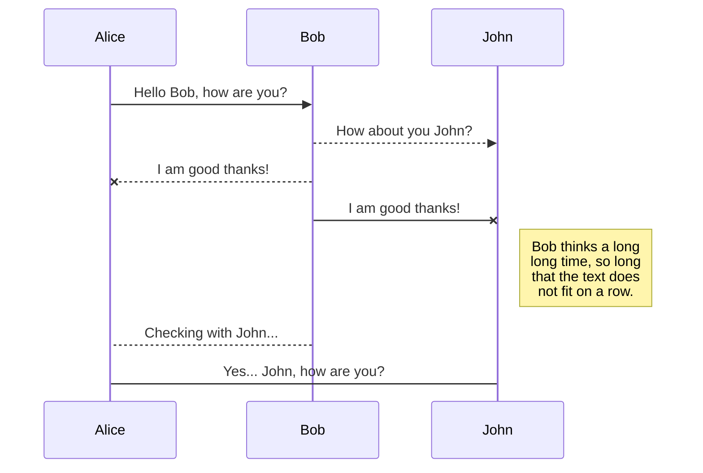
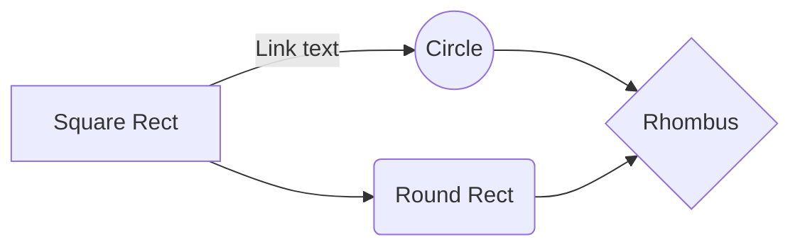

Welcome to Robotics at Falmouth, this is a new programme and course at Falmouth which is part of the **School of Computing** in the **Games Academy**.

We were set-up in 2021 to develop a new capacity at Falmouth to support electronic and robotic development. We primarily serve the needs of robtotics and computing students but we also want to open this facility to all students and staff at Falmouth.

The robotics course shares a common first year with other courses in the Computing subject area, giving students the opportunity to work collaboratively with other disciplines and to get a key insight into how robotics can be used to enhance entertainment systems whether it’s creating social robots, AI or even if its creating prototypes for the future of game controllers and other interfaces with electronic entertainment. 

The teaching and technical staff have both industry and world leading academic experience in a whole range of fields from Artificial Intelligence, Web Technologies, Game Development, Digital Art, Robotics, Physical Computing, Embedded systems and IoT.   


### For Temporary Reference - Markdown & Extensions

StackEdit extends the standard Markdown syntax by adding extra **Markdown extensions**, providing you with some nice features.

> **ProTip:** You can disable any **Markdown extension** in the **File properties** dialog.


## Code

You can use code based on different languages by suffixing the language name to the markdown code 


in **Python**
```python
a = 33
b = 200
if b > a:
  print("b is greater than a")
```

in **C#**
```csharp
// declaring public class
public class Geeks
{

    // field variable
    public int a, b;

      // member function or method
      public void display()
      {
          Console.WriteLine("Class & Objects in C#");
      }
}
```


## SmartyPants

SmartyPants converts ASCII punctuation characters into "smart" typographic punctuation HTML entities. For example:

|                |ASCII                          |HTML                         |
|----------------|-------------------------------|-----------------------------|
|Single backticks|`'Isn't this fun?'`            |'Isn't this fun?'            |
|Quotes          |`"Isn't this fun?"`            |"Isn't this fun?"            |
|Dashes          |`-- is en-dash, --- is em-dash`|-- is en-dash, --- is em-dash|


## KaTeX

You can render LaTeX mathematical expressions using [KaTeX](https://khan.github.io/KaTeX/):

The *Gamma function* satisfying $\Gamma(n) = (n-1)!\quad\forall n\in\mathbb N$ is via the Euler integral

$$
\Gamma(z) = \int_0^\infty t^{z-1}e^{-t}dt\,.
$$

> You can find more information about **LaTeX** mathematical expressions [here](http://meta.math.stackexchange.com/questions/5020/mathjax-basic-tutorial-and-quick-reference).


## UML diagrams

You can render UML diagrams using [Mermaid](https://mermaidjs.github.io/). For example, you can produce a sequence diagram using the markdown code in this page:


And this will produce a flow chart:



The only downside is that diagram text remains black in dark mode of the site.